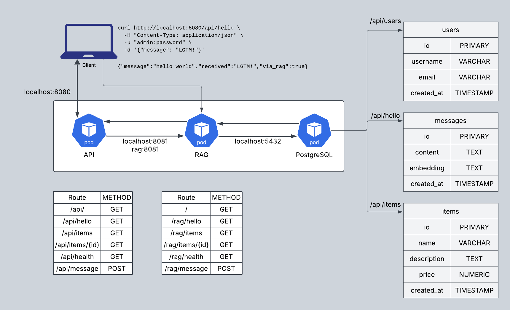

# PostgreSQL, RAG, and FastAPI Application

This project consists of three main components in a layered architecture:
1. A FastAPI-based API service (Frontend)
2. A Retrieval Augmented Generation (RAG) service (Middle Tier)
3. A PostgreSQL database service (Backend)

All services are containerized with Docker and can be run together using Docker Compose.

## Architecture

The application follows this flow:
- **API Service** handles client requests
- **RAG Service** handles data retrieval and processing
- **Database Service** stores and provides data



## Services

### API Service (FastAPI)

Located in the `api_service` directory, this service provides:
- RESTful API endpoints for client applications
- Forwards requests to the RAG service
- No direct database connection

See the [api_service README](api_service/README.md) for more details.

### RAG Service (Retrieval Augmented Generation)

Located in the `rag_service` directory, this service provides:
- Connection to the database for data retrieval
- Data processing and vector embedding capabilities
- Semantic search functionality

See the [rag_service README](rag_service/README.md) for more details.

### Database Service (PostgreSQL)

Located in the `db_service` directory, this service provides:
- PostgreSQL database with sample tables and data
- A "hello world" message stored in the database

See the [db_service README](db_service/README.md) for more details.

## Getting Started

To run all services together with default settings for the database and basic auth:

```bash
# Start all services
./pool.sh start

# Stop all services
./pool.sh stop

# Restart all services and reclaim volumes
./pool.sh restart

# Run `curl` test against the endpoint
./pool.sh test
```

Once running:
- API is accessible at `http://localhost:8080`
- RAG service is accessible at `http://localhost:8081`
- Database is accessible at `localhost:5432`
- Interactive API documentation is available at `http://localhost:8080/docs`

### Authentication

The API is secured with HTTP Basic Authentication:
- Default username: `admin`
- Default password: `password`

You can override these by setting environment variables:
```bash
export API_USERNAME=myusername
export API_PASSWORD=mypassword
./pool.sh start
```

## API Endpoints

With the API service running, API docs can be accessed:

- Swagger UI: `http://localhost:8080/docs`
- ReDoc: `http://localhost:8080/redoc`

### Testing the Endpoint

```bash
curl http://localhost:8080/api/hello \
  -H "Content-Type: application/json" \
  -u "admin:password" \
  -d '{"message": "LGTM!"}'

{"message":"hello world","received":"LGTM!","via_rag":true}
```

```
❯ ./pool.sh test
Sending test POST request to localhost:8080/api/hello...
{"message":"hello world","received":"LGTM!","via_rag":true}%
```


## Reference Docs

### API Service
- [FastAPI](https://fastapi.tiangolo.com/) - Modern, fast web framework for building APIs
  - *Purpose*: Chosen for its high performance, automatic OpenAPI documentation generation, and type validation via Pydantic, enabling rapid API development with minimal boilerplate code
- [Uvicorn](https://www.uvicorn.org/) - ASGI server for Python
  - *Purpose*: Provides the high-performance ASGI server needed to run FastAPI applications, offering excellent concurrency support for handling multiple simultaneous API requests
- [HTTPX](https://www.python-httpx.org/) - HTTP client for Python
  - *Purpose*: Modern HTTP client that supports both sync and async operations, used here to make requests from the API service to the RAG service with support for async/await patterns

### RAG Service
- [Sentence-Transformers](https://www.sbert.net/) - For creating vector embeddings
  - *Purpose*: Transforms text into dense vector representations that capture semantic meaning, enabling similarity search and document retrieval based on meaning rather than exact keyword matching
- [SQLAlchemy](https://docs.sqlalchemy.org/) - SQL toolkit and ORM
  - *Purpose*: Provides a Pythonic interface to interact with the PostgreSQL database, offering both high-level ORM capabilities and low-level SQL execution for flexible data access patterns
- [NumPy](https://numpy.org/doc/) - Scientific computing library
  - *Purpose*: Used for efficient vector operations when computing similarity scores between text embeddings, enabling fast mathematical operations on vector data

### Database Service
- [PostgreSQL](https://www.postgresql.org/docs/) - Open source relational database
  - *Purpose*: Chosen for its robustness, ACID compliance, and ability to handle structured data efficiently while maintaining data integrity through transactions
- [Docker](https://docs.docker.com/) - Containerization platform
  - *Purpose*: Enables consistent deployment of all services in isolated environments, ensuring the application works consistently across different development and production environments
- [Docker Compose](https://docs.docker.com/compose/) - Multi-container orchestration tool
  - *Purpose*: Manages the configuration, networking, and dependencies between services, allowing the entire three-tier application to be defined declaratively and launched with a single command
