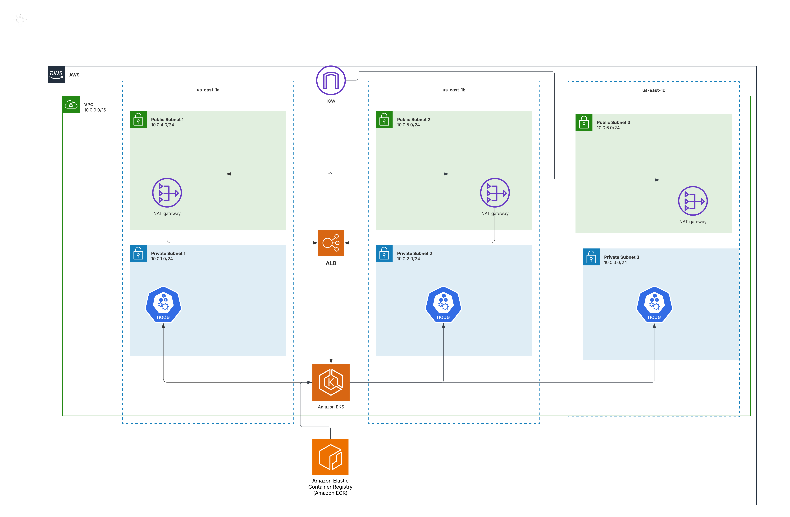
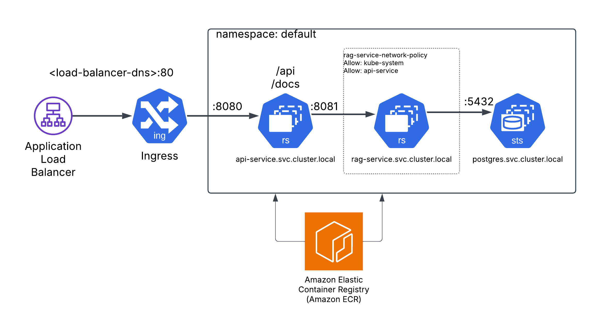

# AWS infrastructure as code

Directory to host AWS IaC

Core configuration is located under `main`.
Deploys the following:

- VPC
- EKS
- Cluster Services
- (Optional) RDS

A Postgres Stateful Set was chosen to deploy in-cluster for this exercise simply to minimize footprint and cloud costs.  
RDS can be equally utilized, with the connection string provided to the services.

Cloud Architecture:



App Architecture:


Create an AWS Profile:

```bash
aws configure
AWS Access Key ID [None]: ####
AWS Secret Access Key [None]: #######
Default region name [None]: us-east-1
Default output format [None]: json
❯ aws sts get-caller-identity

{
    "UserId": "AIDATUN3C3U4CEJF3TQIM",
    "Account": "######",
    "Arn": "arn:aws:iam::######:user/terraform-dev"
}
```

Deploy via init wrapper script:
```bash
./init.sh
```
