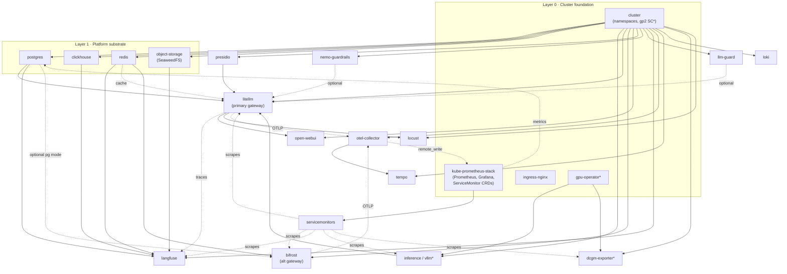

# Component Dependency Lineage (dev)

How the `dev/` components depend on one another. Deploy **top-down** (a component's
dependencies must be healthy first); tear down bottom-up. `deploy.sh` encodes this order.

## Graph

`*` = requires/produces GPU or cluster-provided primitives (gp2 StorageClass, GPU nodes).
Dashed edges are optional / runtime-config wiring (not hard ordering).

## Dependency table

| Component | Hard prerequisites | Depended on by |
|-----------|--------------------|----------------|
| **cluster** (namespaces) | a `gp2` StorageClass (cluster-provided) | everything |
| **kube-prometheus-stack** | cluster | servicemonitors, postgres metrics, otel-collector (remote_write) |
| **ingress-nginx** | cluster | external access to UIs (optional) |
| **gpu-operator** | cluster, GPU nodes | inference/vllm, dcgm-exporter |
| **postgres** | cluster | litellm, langfuse, bifrost (optional) |
| **clickhouse** | cluster | langfuse |
| **redis** | cluster | langfuse, bifrost, litellm (cache) |
| **object-storage** (SeaweedFS) | cluster | langfuse |
| **inference/vllm** | cluster, gpu-operator, GPU | litellm (backend), vllm ServiceMonitor |
| **litellm** | postgres, inference backend; presidio (PII); redis, langfuse (optional) | open-webui, locust, litellm ServiceMonitor |
| **bifrost** | redis; otel-collector (telemetry); postgres (optional HA) | bifrost ServiceMonitor |
| **open-webui** | litellm | — |
| **presidio** | cluster | litellm (PII guardrail) |
| **nemo-guardrails** | cluster | litellm (optional rail) |
| **llm-guard** | cluster | litellm (optional scanner) |
| **tempo** | cluster | otel-collector (trace backend) |
| **loki** | cluster | (log store; add a shipper to populate) |
| **otel-collector** | tempo, kube-prometheus-stack | bifrost / litellm traces |
| **langfuse** | postgres, clickhouse, redis, object-storage | litellm (tracing), langfuse ServiceMonitor |
| **dcgm-exporter** | cluster, GPU, kube-prometheus-stack | dcgm ServiceMonitor |
| **servicemonitors** | kube-prometheus-stack + target services | Prometheus scrape config |
| **locust** | litellm → inference | — |

## The critical path (thin vertical slice)

`cluster → postgres → inference/vllm → litellm → (one prompt/response)`

Everything else (guardrails, the second gateway, the observability stack, load testing)
layers on top of that slice.
